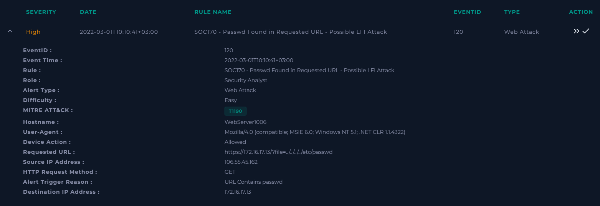

# SOC170 — Possible LFI Attack Detected

## Summary
**Classification:** True Positive
**Severity:** High
**Verdict:** Malicious, attempt unsuccessful — no escalation required

A source IP attempted a Local File Inclusion (LFI) attack via path traversal against a public-facing web server, targeting `/etc/passwd`. The request was allowed through by network controls but failed at the application level.

## Alert Details

| Field | Value |
|---|---|
| Event ID | 120 |
| Rule | SOC170 - Passwd Found in Requested URL - Possible LFI Attack |
| MITRE ATT&CK | [T1190 - Exploit Public-Facing Application](https://attack.mitre.org/techniques/T1190/) |
| Source IP | 106[.]55[.]45[.]162 (China) |
| Destination | WebServer1006 (172[.]16[.]17[.]13) |
| Requested URL | `?file=../../../../etc/passwd` |
| HTTP Method | GET |
| Event Time | 10:10, 01.03.2022 |
| Trigger Reason | Requested URL contains "passwd" |

## Investigation

**Threat Intelligence:**
- AbuseIPDB: source IP reported **3,425 times**
- VirusTotal: community score of **-7**, reinforcing a malicious classification

**Request Analysis:**
The request attempted directory traversal (`../../../../etc/passwd`) to read the server's password file — a classic LFI technique used to pull sensitive system files by walking up the directory tree from a web-accessible path.

**Outcome Verification:**
This is the part of the investigation that matters most — confirming impact, not just intent. Two independent checks were used rather than relying on one:
1. **Server response:** HTTP Status 500 with a response size of 0 — the server errored out rather than returning file contents, indicating the traversal did not resolve to a readable file
2. **Endpoint investigation:** Review of WebServer1006's file access logs and process history found no evidence of successful file access or any follow-up activity

Both checks independently support the same conclusion: the attempt failed.

## Verdict
Classified as **True Positive** — confirmed Exploit Public-Facing Application attempt (T1190). The attack was unsuccessful based on server response and endpoint forensics.

## Recommendations
1. Add source IP 106[.]55[.]45[.]162 to blacklist
2. **Review WAF/IPS rules** — this request was allowed through despite containing an obvious path traversal pattern (`../../`) and a sensitive filename (`passwd`). A properly tuned WAF should have blocked this at the perimeter rather than relying on the application to fail safely
3. Alert closed as malicious; no escalation required

## Lessons / Notes
An unsuccessful attack is still a real attack — the fact that this one failed came down to the server erroring out, not to any preventive control catching it. That's a gap worth flagging separately from the incident itself.
